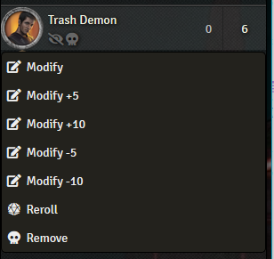

# Combat-Modify-Initiative
A community module for FoundryVTT.

Allows to quickly modify initiative results by fixed amounts.

Module was made for Shadowrun 5 but can be configured to use other modify numbers using module settings.

## Installation

Paste the following link in the Install Module interface of your Foundry VTT instance:

https://raw.githubusercontent.com/taMiF/Combat-Modify-Initiative/master/module.json
